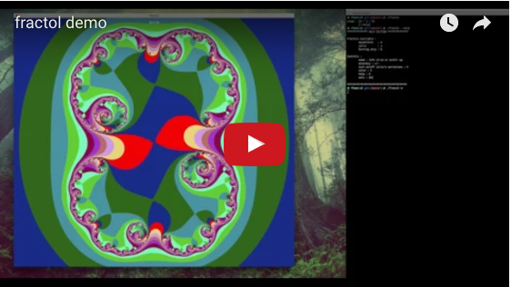

# **Fract'ol**
#### *It's the second project in the graphic branch.*

The subject asks to code a **C** program wich can **display** a **representation of a fractal** and allow the user to **interact with it**.

We are allowed to use the **minilibx library** to manipulate a window and drow in it.
The main difficulties are to **find mathematical expressions** and **optimize it**.

## **The render**

<iframe width="560" height="315" src="https://www.youtube.com/embed/r6DjCYjN0so" frameborder="0" allowfullscreen></iframe>

## **Commands availables**

* Zoom						**Q / W**
* Height modification		**+ / -**
* Change color				**C**
* Debug color mod			**D**
* Quit						**ESC**

## **Disclaimer**

The minilibx version is for MacOs so it probably won't work on other OS.

